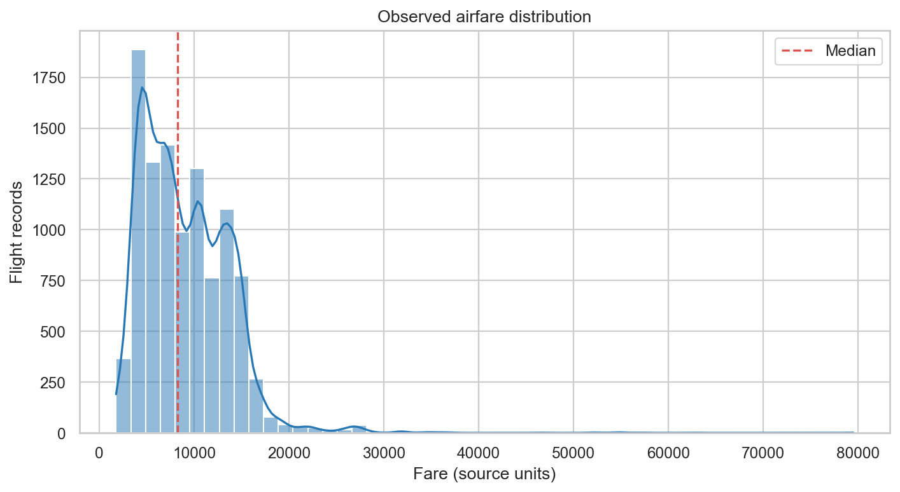
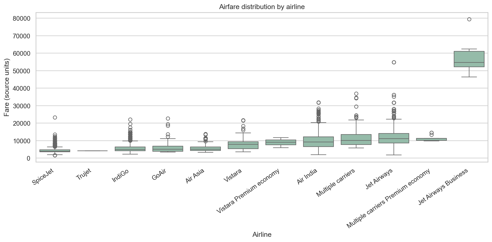
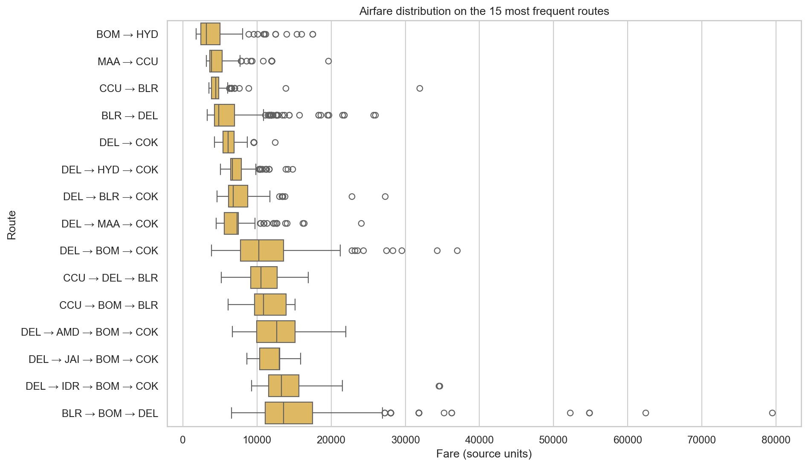
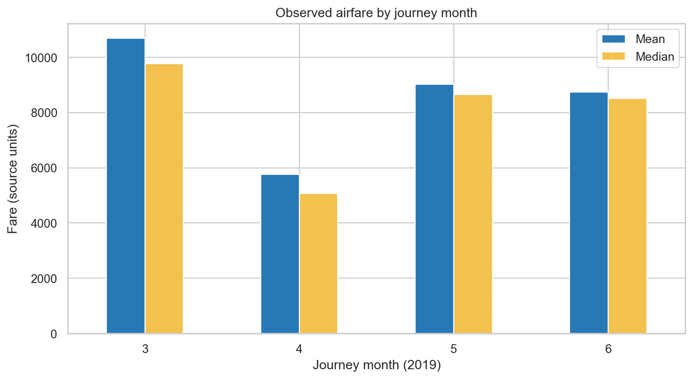
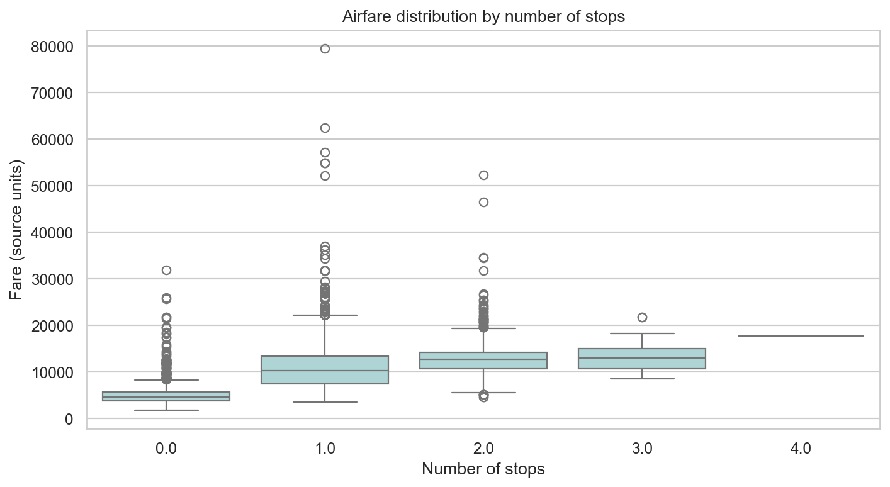
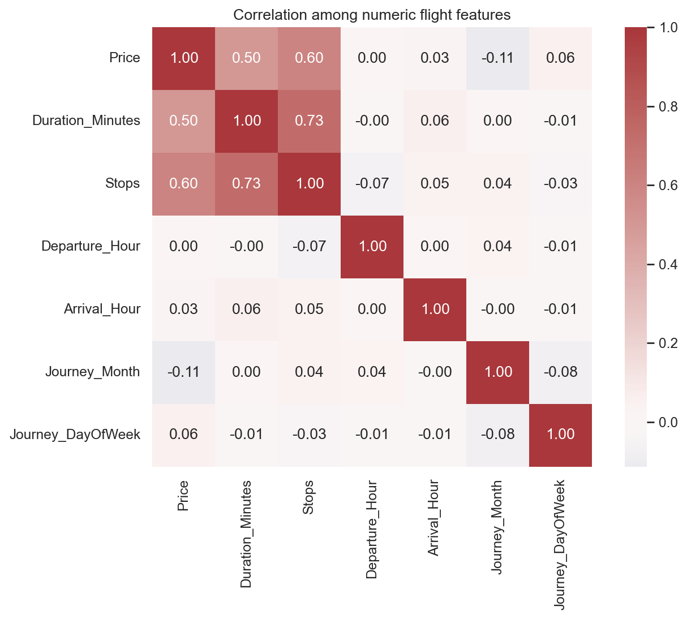
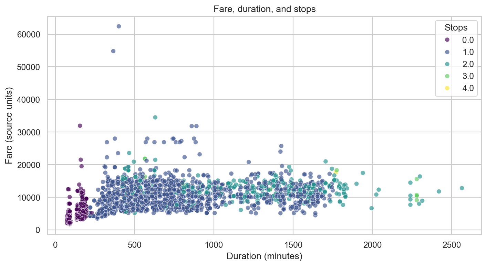
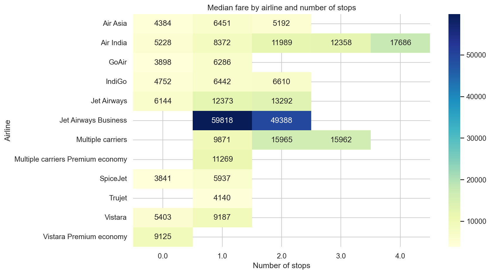

# Airlytics Phases 1–5 Analysis

Generated by `python scripts/phase1_5_analysis.py` from the versioned source workbook.

## Phase 1 — Problem definition

**Problem.** Airfare varies with airline, route, journey date, flight duration, and stops. Travelers lack a simple historical reference for comparing fares.

**Objective.** Describe historical airfare patterns and their associations with the available flight attributes. The work is exploratory and does not claim to forecast current or future prices.

**Scope.** This phase uses the labeled India-market training workbook only. It analyzes prices, route, airline, journey date, duration, and stops. The companion test workbook has no price target and is not included in fare analysis. Booking date is absent, so booking-window analysis is out of scope. Currency is not specified in the publisher's dataset metadata; all fare values are therefore reported in source units.

## Phase 2 — Dataset selection and collection

- **Dataset:** Flight Price Prediction DataSet, version 1 (`Data_Train.xlsx` and `Test_set.xlsx`)
- **Publisher/source:** Jillani SofTech; the dataset description says it was obtained from the EaseMyTrip website
- **Source:** [Kaggle dataset page](https://www.kaggle.com/datasets/jillanisofttech/flight-price-prediction-dataset)
- **License listed by publisher:** CC0: Public Domain
- **Labeled workbook:** 10,683 rows × 11 columns
- **Unlabeled companion workbook:** 2,671 rows × 10 columns
- **Target:** `Price` (source units)
- **Schema and limitations:** See [`data/README.md`](../data/README.md).

The observations are historical snapshots, not a representative sample of every airline or market. The publisher does not document the collection methodology, currency, taxes/fees, fare class, or booking timestamp. The data is from 2019 and should not be interpreted as current market pricing.

## Phase 3 — Data cleaning

| Check | Result |
|---|---:|
| Raw labeled rows | 10,683 |
| Exact duplicate rows removed | 220 |
| Rows remaining after validation | 10,462 |
| Rows excluded for one or more invalid/missing required fields | 1 |
| Source spelling values normalized (`Banglore` → `Bangalore`) | 5,068 |
| Fare outliers flagged and retained (below / above 1.5×IQR fences) | 0 / 94 (94 total) |

Missing values in the raw labeled workbook:

| Column | Missing |
|---|---:|
| `Route` | 1 |
| `Total_Stops` | 1 |

Cleaning parses journey dates, duration into minutes, stops into a numeric count, and departure/arrival clock times into decimal hours. Rows missing required analysis fields, with invalid dates, non-positive fares/durations, or invalid stop counts are excluded. Exact duplicates are removed. Outliers are flagged, not dropped, because unusually high fares may be valid observations.

## Phase 4 — Exploratory data analysis

The charts below cover fare distribution, airline and route comparisons, monthly price patterns, stops, numeric correlations, and the interaction of duration and stops with fare.










In the cleaned sample, the airline with the lowest/highest median fare is **SpiceJet** / **Jet Airways Business**. Among routes with at least 25 observations, the lowest/highest median fare is on **BOM → HYD** / **DEL → JDH → BOM → COK**. The lowest/highest journey-month median is in **April** / **March**. These are descriptive sample comparisons, not causal effects or live price guidance.

## Phase 5 — Statistical analysis

| Statistic | Result |
|---|---:|
| Valid observations | 10,462 |
| Mean fare | 9,026.79 |
| Standard deviation | 4,624.85 |
| Median fare | 8,266.00 |
| Interquartile range | 7,120.75 |
| Minimum / maximum | 1,759.00 / 79,512.00 |
| Spearman ρ (duration vs fare) | 0.694 |
| Spearman p-value | underflowed to 0.0 |
| Kruskal–Wallis H (fare by airline) | 4753.89 |
| Kruskal–Wallis p-value | underflowed to 0.0 |

The positive Spearman coefficient indicates that longer flights tended to be associated with higher fares in this sample. The Kruskal–Wallis result indicates fare distributions vary across at least some airline groups; it does not identify which pairs differ. SciPy's reported zero p-values reflect floating-point underflow, not probabilities that are literally zero. Both tests are observational, sensitive to sample size and confounding, and do not establish causality. The airline test was run on groups with at least two observations.

## Reproducibility

Install `requirements-analysis.txt`, then run:

```powershell
python scripts/phase1_5_analysis.py
```

The script writes `cleaned_fares.csv`, this report, and the PNG figures into `outputs/phase1_5/`.
